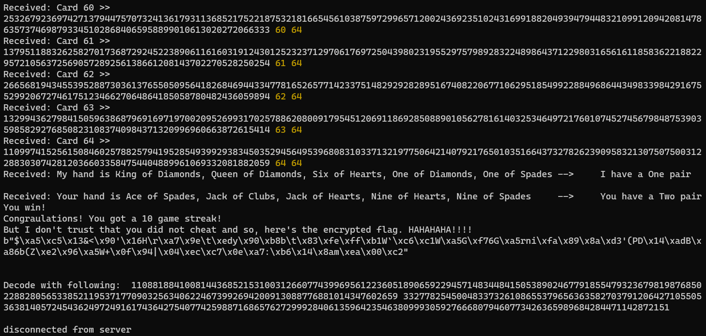
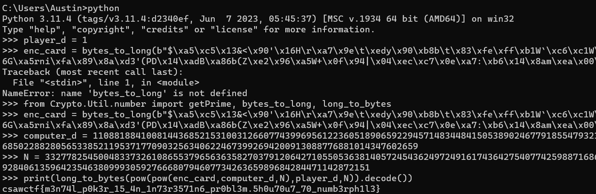

# CSAW '23 Qualifiers Writeups

I am really glad to have had the opportunity to participate in the CSAW CTF competition for 2023 as a part of the [49th Security Division](https://49sd.com/) from September 15th to 17th, 2023!

Our team earned 2834 points, placing us at 103rd place out of the nearly 1,500 teams that competed.


I completed 6 challenges, earning 1608 points for my team, although I may or may not have ended up getting no sleep at all this weekend in the process...

And here are some writeups for the challenges I completed in this competition!

The points for the challenges were not predetermined, but determined by the number of people who solved them. The maximum points for a challenge was 500, but this decreased as more people solved the challenges.

Overall, I had a lot of fun with this competition and definitely can't wait to hopefully participate next year too!


# Web: Philanthropy

**Points:** 186

**Author:** Enigma

**Description:** Can you break into the Philanthropy website and get more information on Snake and Otacon?

**Links:** [http://web.csaw.io:14180/web/home](http://web.csaw.io:14180/web/home)

## Writeup

As always with any web challenge, the first step is recon!

The challenge description gives us our targets: two users known as Snake and Otacon. Well, right on the about page is information on Otacon's email!


Anyways, there isn't much else that we can see before logging in, so we can register a new fake user and log in!


Now that we're logged in, we can see a bit more, including a tab for "Profile" and a tab for "Membership". The latter hints at access control which may help us get the information we need to get the flag!

Looking at the Membership tab, we see a prompt for a code. We don't have a code right now, but this does verify that there is a way to get a membership for the website and access more information!


This membership must be stored somewhere to be used, and it might also be included in web requests! In particular, using the DevTools Network tab, we can see an endpoint, `/identity/verify`, which includes this information.


Since the `Member` attribute is false, we may be able to modify this information!

Once we look at the Profile tab, we can see that we do have the ability to modify our user's information, including the display name. And when we modify it, we can see a request to `/identity/update` that we can capture!


We can use JavaScript to send this request with `fetch`!

```js
fetch("http://web.csaw.io:14180/identity/update", {
  "headers": {
    "accept": "application/json, text/plain, */*",
    "accept-language": "en-US,en;q=0.9",
    "content-type": "application/json"
  },
  "referrer": "http://web.csaw.io:14180/web/profile",
  "referrerPolicy": "strict-origin-when-cross-origin",
  "body": "{\"username\":\"test@uncc.edu\",\"first_name\":\"TestUser\",\"last_name\":\"TestTest\", \"member\":true}",
  "method": "POST",
  "mode": "cors",
  "credentials": "include"
});
```

This is pretty easy to do since we can just copy the result as fetch and add `\"member\":true` to make ourselves a member.

This update doesn't show immediately, but if we clear cookies and refresh, we can see that we are now a member and have access to even more, including a flag page!


However, we cannot see the flag at this page and need to do a bit more digging! We do have access to another page, Identify, though! The page includes a mini quiz game to identify pictures of "Metal Gear" robots. When these images are loaded, we can see that the request is directly tied to Otacon's email!


We can also see credit to `solidsnake@protonmail.com`, which seems to be our other target, so let's check that by modifying the URL and opening in a new tab!


And opening the image specified, we get a password!


And logging in, we can access the flag!


And our flag is `csawctf{K3pt_y0u_Wa1t1ng_HUh}`!


# Forensics: 1black0white

**Points:** 50

**Author:** robert-todora

**Description:** We received this file of seemingly random numbers, but the person that sent it is adamant that it is a QR code. Can you figure it out for us?

**Files:** [qr_code.txt](files/1black0white/qr_code[1].txt)

## Writeup

In this challenge, the title gives away a lot of really useful information. QR codes include the colors black and white, and if 1 is black and 0 is white, maybe the QR code is encoded in the binary forms of the numbers in the list!

Starting out, we can parse through the numbers with JavaScript to get how many bits most of these numbers are.


Most seem to be 29, which is also the length of the file! This is perfect, the QR code is a perfect 29x29 square!

With a bit further parsing, we can get the data in binary, padded with 0s at the front for shorter lines.


And now, we just need to find a way to render the QR code! [Scratch](https://scratch.mit.edu/projects/editor) has a pretty good and easy-to-use GUI that also keeps you from having to create much more yourself! This could also be done with HTML5 canvas, PyGame (maybe even Turtle), or other common GUI-based frameworks, but just to make it easy, I used Scratch!

Just rendering with 1 as black and 0 as white and a list to store the binary data, and a custom block to create better squares rather than dots, we can get a QR code!


And scanning this with any smartphone, we get our flag, `csawctf{1_d1dnt_kn0w_th1s_w0uld_w0rk}`!

The Scratch project's SB3 file can also be found [here](files/1black0white/Scratch%20Project.sb3)!


# Intro: whataxor

**Points:** 75

**Author:** ElykDeer

**Description:** Now you actually need to figure what the binary is doing.......maybe try a tool like https://dogbolt.org/; It shows you the output of several tools that try to extract a representation similar to what the original code might have looked like.....which is a lot nicer than reading bytes.

**Files:** [readme.txt](files/whataxor/readme[1].txt), [whataxor](files/whataxor/whataxor[1])

## Writeup

Turns out the description of this challenge already gives us the tool we can use! We can start just by uploading the binary to [dogbolt](https://dogbolt.org) and start reading through the decompiled code!

Dogbolt gives us this C code for our main function:

```c
undefined8 main(void)

{
  int iVar1;
  long in_FS_OFFSET;
  char local_c8;
  undefined local_c7;
  undefined local_c6;
  undefined local_c5;
  undefined local_c4;
  undefined local_c3;
  undefined local_c2;
  undefined local_c1;
  undefined local_c0;
  undefined local_bf;
  undefined local_be;
  undefined local_bd;
  undefined local_bc;
  undefined local_bb;
  undefined local_ba;
  undefined local_b9;
  undefined local_b8;
  undefined local_b7;
  undefined local_b6;
  undefined local_b5;
  undefined local_b4;
  undefined local_b3;
  undefined local_b2;
  undefined local_b1;
  undefined local_b0;
  undefined local_af;
  undefined local_ae;
  undefined local_ad;
  undefined local_ac;
  undefined local_ab;
  undefined local_aa;
  undefined local_a9;
  undefined local_a8;
  undefined local_a7;
  undefined local_a6;
  undefined local_a5;
  undefined local_a4;
  undefined local_a3;
  undefined local_a2;
  undefined local_a1;
  undefined local_a0;
  undefined local_9f;
  undefined local_9e;
  undefined local_9d;
  undefined local_9c;
  undefined local_9b;
  undefined local_9a;
  undefined local_99;
  undefined local_98;
  undefined local_97;
  undefined local_96;
  undefined local_95;
  undefined local_94;
  undefined local_93;
  undefined local_92;
  undefined local_91;
  undefined local_90;
  undefined local_8f;
  undefined local_8e;
  undefined local_8d;
  undefined local_8c;
  undefined local_8b;
  undefined local_8a;
  undefined local_89;
  undefined local_88;
  undefined local_87;
  undefined local_86;
  undefined local_85;
  undefined local_84;
  undefined local_83;
  undefined local_82;
  char local_78 [104];
  long local_10;
  
  local_10 = *(long *)(in_FS_OFFSET + 0x28);
  printf("Enter your password: ");
  __isoc99_scanf(&DAT_00100b1a,local_78);
  xor_transform(local_78,0xffffffaa);
  local_c8 = -0x37;
  local_c7 = 0xd9;
  local_c6 = 0xcb;
  local_c5 = 0xdd;
  local_c4 = 0xc9;
  local_c3 = 0xde;
  local_c2 = 0xcc;
  local_c1 = 0xd1;
  local_c0 = 0x9a;
  local_bf = 0xc4;
  local_be = 0xcf;
  local_bd = 0xf5;
  local_bc = 0xd9;
  local_bb = 0xc2;
  local_ba = 0xcf;
  local_b9 = 0xcf;
  local_b8 = 0xfa;
  local_b7 = 0xf5;
  local_b6 = 0x9b;
  local_b5 = 0xdd;
  local_b4 = 0xc5;
  local_b3 = 0xf5;
  local_b2 = 0xd9;
  local_b1 = 0xc2;
  local_b0 = 0xcf;
  local_af = 0xfd;
  local_ae = 0xda;
  local_ad = 0xf5;
  local_ac = 0x98;
  local_ab = 0xc2;
  local_aa = 0xd8;
  local_a9 = 0xcf;
  local_a8 = 0xcf;
  local_a7 = 0xf5;
  local_a6 = 0x9f;
  local_a5 = 0xc2;
  local_a4 = 0xcf;
  local_a3 = 0xcf;
  local_a2 = 0xc1;
  local_a1 = 0xd9;
  local_a0 = 0xf5;
  local_9f = 0xf5;
  local_9e = 0xf5;
  local_9d = 0xf5;
  local_9c = 0xf5;
  local_9b = 0xd0;
  local_9a = 0xf5;
  local_99 = 0xf5;
  local_98 = 0xf5;
  local_97 = 0xd0;
  local_96 = 0xd0;
  local_95 = 0xd0;
  local_94 = 0xf5;
  local_93 = 0xf5;
  local_92 = 0xf5;
  local_91 = 0xf5;
  local_90 = 0xf5;
  local_8f = 0xd0;
  local_8e = 0xd0;
  local_8d = 0xd0;
  local_8c = 0xd0;
  local_8b = 0xd0;
  local_8a = 0xd0;
  local_89 = 0xf5;
  local_88 = 0xf5;
  local_87 = 0xf5;
  local_86 = 0xf5;
  local_85 = 0xd2;
  local_84 = 0xc5;
  local_83 = 0xd8;
  local_82 = 0xd7;
  iVar1 = strcmp(local_78,&local_c8);
  if (iVar1 == 0) {
    puts("Correct!");
  }
  else {
    puts("Access denied.");
  }
  if (local_10 != *(long *)(in_FS_OFFSET + 0x28)) {
                    // WARNING: Subroutine does not return
    __stack_chk_fail();
  }
  return 0;
}
```

Most notably perhaps, there is a call to a function, `xor_transform` with the parameters being `local_78` (which is the string we input into the program) and `0xffffffaa`. Then, this is compared to another string starting at `local_c8`. However, with endianness in mind, this actually goes backwards from `local_c8` to `local_82`, which is thankfully in order for us in the decompiled code!

Using a bit of JavaScript to parse this for us, we can get our hexadecimal string to run XOR on!


However, once we copy this into [CyberChef](https://gchq.github.io/CyberChef/), we need to check the first byte. In the code, it is `-0x37`, which when unsigned is the same as `0x100 - 0x37 = 0xc9`, which we should use instead! Also we can remove the "f"s padding the XOR key since we're only using single-byte hexadecimal values rather than UTF-8. 


But ultimately, we can get our flag, `csawctf{0ne_sheeP_1wo_sheWp_2hree_5heeks_____z___zzz_____zzzzzz____xor}`!


# Crypto: Mental Poker

**Points:** 488

**Author:** Dhyey Shah (CTFd)

**Description:** Let's play some mental poker.

`nc crypto.csaw.io 5001`

**Files:** [server.py](files/poker/server[1].py)

## Writeup

This challenge was probably my favorite of the entire competition!

Luckily, we are given the source code, which helps us understand the steps we need to perform and the encryption used.

Here are the steps the program follows:
1. Create a deck of cards in a predictable manner to then shuffle randomly.
2. Get the values of p, q, phi, and N for RSA encryption. p and q are prime numbers, phi = (p-1)(q-1), and N is the modulus, equal to p*q.
3. Give the values of p and q to the user for the purpose of generating their own public and private keys.
4. Receive the user's public exponent (commonly referred to as e).
5. Receive the user's private exponent (commonly referred to as d).
6. Start the first rounds of the game.
7. Shuffle the deck at the start of each round using a custom pseudorandum number generator (PRNG).
8. On the first round, generate the computer's public and private keys also using the same PRNG.
9. Encrypt all shuffled cards using RSA with both the computer's and user's public keys.
10. Give the user the list of all encrypted cards.
11. Read back the encrypted cards from the user one-by-one in the order they choose. Verify these are valid cards by decrypting them and comparing them to cards in the deck.
12. Verify that there are no duplicates in the shuffled deck. If there are duplicates, there is an error thrown.
13. Pick the first 5 cards to be the computer's hand and the next 5 as the player's hand.
14. Determine the winner based on the combinations and ranks of the cards in each player's hand. This also sorts the hands by rank.
15. Print the results of the game, including each hand sorted, what combination each player had (high card, pair, flush, etc.), and who won.
16. Repeat until the user has won 10 games in a row.
17. Print the flag RSA-encoded with the computer's public key.

With this in mind, there are a few things we need to do:
1. We need to connect to the application through a TCP socket connection.
2. We need to use the values of p and q to determine phi and N.
3. We need to provide valid public and private exponents to the application.
4. We need to be able to read the list of shuffled cards and send the information back one-by-one.
5. We need to be able to reorder the cards to ensure we can win 10 in a row.
6. We need to use the cards in the hands given to determine the seed of the PRNG.
7. We need to use this known seed of the PRNG to replicate the public exponent generation to get the computer's e.
8. We need to use e and phi to calculate d.
9. We need to use d and N to decrypt cards so we can reorder them properly.
10. We need to be able to decrypt the final flag also using d and N.

Step 1 is pretty easy. With Node.js, my choice for this program, we just need this:

```js
const net = require('node:net');
const client = net.createConnection({ host: "crypto.csaw.io", port: 5001 }, () => {
  // 'connect' listener.
  console.log('connected to server!');
});
```

And we can use `client` to handle the connection through the `data` event and `write` method.

Step 2 is also easy! `N = p*q` and `phi = (p-1)*(q-1)`!

Step 3 is also easy! Turns out, 1 is a valid public and private key, just it doesn't actually encrypt anything! This does make it easier for us, though!

Step 4 just involves a bit of input parsing to read the list into an array that we can then send back as we receive prompts asking for each card.

Step 5 is a bit more tricky... We'll get to that one later!

Step 6 needs a bit of experimentation...

Step 7 is easy once we get the seed from step 6. All we need to do is repeat the process used by the computer to get the value of e!

Step 8 is also easy once we get e, since all we need to do is modularly invert it!

Step 9 is super easy considering we have the decryption code in Python already from the source code, just we need that value of d!

And step 10 will also be easy for the same reasons as 9!

So our real challenges are steps 5 and 6, dealing with reordering the cards and cracking the PRNG...

### Cracking the PRNG

Given that this is a CTF competition, we can already assume this PRNG is vulnerable. Also, it depends on just one value, the seed. And each random number only depends on three values individually, meaning there isn't much redundance. And the results of the PRNG are not complex, only being whole numbers 0 to 63, inclusive. So maybe there's a chance for overlap with the seeds?

With the code in [testing2.py](files/poker/testing2.py) (ignore the name, I just overwrote testing.py and had to recreate it), I tried to bruteforce the seed and noticed something pretty interesting!

Every seed generated could be cracked, but not as the same seed, but a much lower number, below 1000, that produced the exact same deck of cards when running the shuffling algorithm.


This overlap in seeds makes it really easy to crack the PRNG and predict the next numbers! 

Of course, I wrote the rest in JavaScript, though, so I had to convert the PRNG! 

This code is equivalent to the Python version:

```js
class PRNG {
  constructor(seed = 149926132869534543) {
    this.seed = seed;
    this.state = [this.seed]
    this.index = 64
    for(let i = 0; i < 63; i++) {
      this.state.push((3 * (this.state[i] ^ (this.state[(i-1)%this.state.length] >> 4)) + i+1)%64);
    }
  }

  toString() {
    return self.state.toString();
  }

  getnum() {
    if(this.index >= 64) {
      for(let i = 0; i < 64; i++) {
        let y = (this.state[i] & 0x20) + (this.state[(i+1)%64] & 0x1f);
        let val = y >> 1;
        val = val ^ this.state[(i+42)%64]
        if(y & 1) {
          val = val ^ 37
        }
        this.state[i] = val
      }
      this.index = 0;
    }
    let seed = this.state[this.index]
    this.index += 1;
    return (seed*15 + 17)%(2**6)
  }
}
```

I had some issues at first with the PRNGs not matching up right, and figured out that the issue was in that Python wraps negative indices around the back of lists while JavaScript just returns `undefined` for negative indices on arrays, hence the `(i+1)%64` part!

And in converting, there was one more issue: the test bruteforcer used the order rather than just presence of the cards, and the application sorts the cards before returning them.

Well, luckily, that doesn't matter, and there is only one combination that includes those cards in the first hand!

This code can solve the seed of the PRNG:

```js
function getSeed(received_deck) {
  console.log(getNum(0,received_deck));
  for(let seed = 0; seed < 256**8;seed++) {
   let trng = new PRNG(seed);
   let pdeck = shuffle(deck, trng);
   let broken = false;
   for(let i = 0; i < 5; i++) {
     if(!received_deck.slice(0,5).map(n=>n.toString()).includes(pdeck[i].toString())){//(getNum(i, pdeck) != getNum(i,received_deck)) {
       broken = true;
       break;
     }
   }
   if(!broken) {
     console.log(seed,pdeck.map(n=>n.toString()),received_deck.map(n=>n.toString()));
     return seed;
     break;
   }
  }
  throw new Error("Seed not found");
}
```

And using this, we can find the computer's RSA keys!

### Finding the Keys

Finding the keys is relatively straight-forward. You just create a PRNG with the same seed, request the same number of random numbers for card shuffling, and then start using it to calculate the key!

I was just a bit lazy...

Instead of converting this code to JavaScript, I used a subprocess to spawn a clone of the server's Python code, passing the primes (p and q) and seed through command-line arguments, commenting out existing print statements, printing the values of e, d, phi, and N, and then reading the stdout of the process in JavaScript to retrieve this data for future use! This is partially because Python is a lot better at modular exponent calculations, and also because I was lazy!

Here is the JavaScript code:
```js
async function impersonate(rngseedstuff, prime1, prime2) {
  const pythonProcess = spawn('python',["impersonate.py", rngseedstuff.toString(), prime1.toString(), prime2.toString()]);
  pythonProcess.stderr.on("data", n=>console.log(''+n));
  let result = await new Promise((resolve,reject) => {pythonProcess.stdout.once("data", resolve);});
  console.log(result.toString());
  return result;
}
```

The function has to be asynchronous to deal with the fact that the subprocess uses events to communicate stdout data. However, I just made the functions surrounding it async too to deal with this! Ultimately, it doesn't really matter what round the reordering starts on, so running this in the background and then using a variable to indicate when the RSA keys were found wasn't an issue.

I also used a similar method for decoding values!

Here is the JavaScript code for that one:

```js
async function decodeData(enc, computer_d, N) {
  const pythonProcess = spawn('python',["decode.py", BigInt(enc).toString(), computer_d.toString(), N.toString()]);
  pythonProcess.stderr.on("data", n=>console.log(''+n));
  let result = await new Promise((resolve,reject) => {pythonProcess.stdout.once("data", resolve);});
  console.log(result.toString());
  return result;
}
```

And the Python code!

```py
from math import gcd
import sys
from Crypto.Util.number import getPrime, bytes_to_long, long_to_bytes


enc_card = int(sys.argv[1])
computer_d = int(sys.argv[2])
N = int(sys.argv[3])
player_d = 1

print(long_to_bytes(pow(pow(enc_card,computer_d,N),player_d,N)).decode())
sys.stdout.flush()
```

This was way easier than implementing everything directly in JavaScript, especially since the makers of this challenge already implemented it for us!

### Putting It Together

Anyways, we needed to put everything together to get the flag!

For reordering the cards, I just made my program send the same winning deck by encrypting the cards in that deck and sending those, mostly ignoring the received deck! Since the deck and encryption keys don't change, this luckily worked!

And I made my code, which can be found [here](files/poker/hacking.js), and got the encrypted key!



And with the Python REPL, I got the flag!



And the flag is `csawctf{m3n74l_p0k3r_15_4n_1n73r3571n6_pr0bl3m.5h0u70u7_70_numb3rph1l3}`!


# Incident Response: What is going on?

**Points:** 382

**Description:** The HudsonHustle company has contacted you as they are not able to figure out why they can not access any of their files. Can you figure out what is going on?

**Files:** network.pcap, server2019.vmdk, win10.vmdk (downloaded from zip file in first IR challenge)

## Writeup


# Incident Response: Initial Access

**Points:** 427

**Description:** How were they hacked?!?!

`nc misc.csaw.io 5001`

## Writeup


