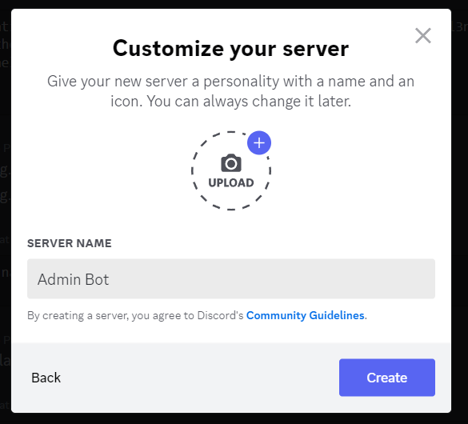
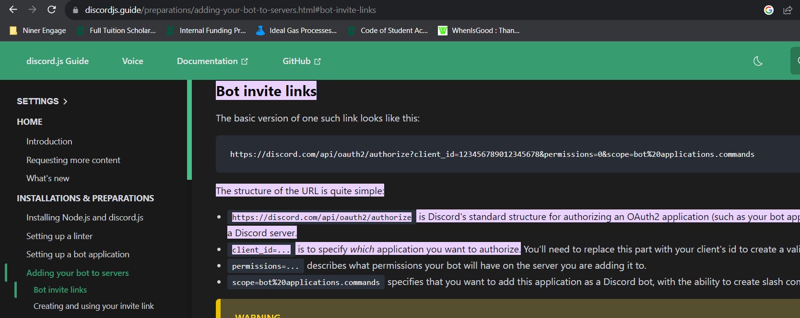
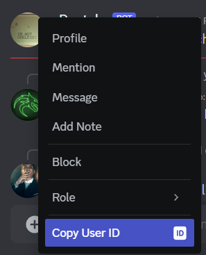
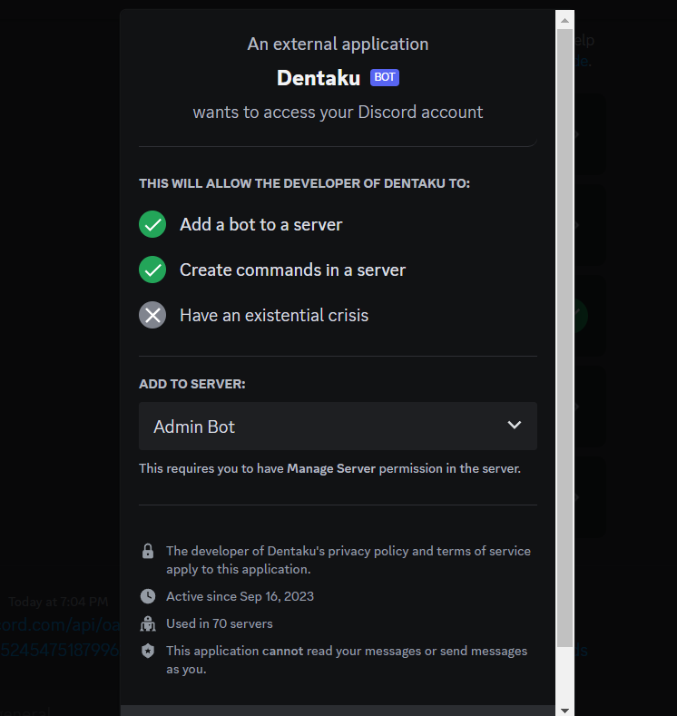
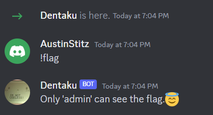
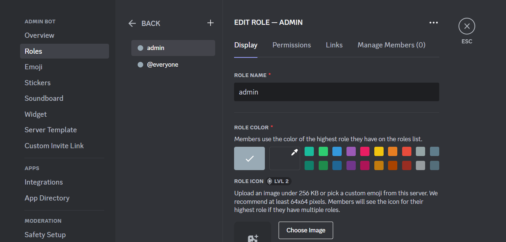
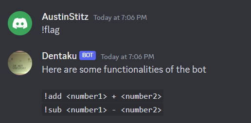
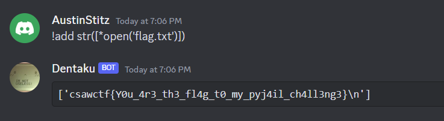

# Challenges Solved Later

Well, I didn't solve all of the challenges during the competition, so here are some writeups for challenges I solved after the fact, maybe with a couple hints about where to look!

# Misc: Discord Admin Bot

**Points:** 314

**Author:** Krishnan Navadia

**Description:** Join discord and get the flag.

discord.gg/csaw23 discord.gg/csaw23 discord.gg/csaw23 discord.gg/csaw23 discord.gg/csaw23 discord.gg/csaw23 discord.gg/csaw23 discord.gg/csaw23 discord.gg/csaw23 discord.gg/csaw23

**Files:** [bot_send.py](files/discord/bot_send[1].py)

## Writeup

Looking through the code, we can't really do anything without a certain admin role...

And after joining the server, we can see the bot but not get that role!

But we can invite the bot to our server!

First, we need to make a server...



Then, performing a quick Google search, we can find a general format for the bot invite link!



It appears that `client_id` refers to a user ID in Discord, perhaps that of the bot, so we can try using this! We need to have Developer Mode on on Discord, though, to have access!



Just with a right click and the context menu, we can get the ID!

The ID is `1152454751879962755`, so our invite link will be `https://discord.com/api/oauth2/authorize?client_id=1152454751879962755&permissions=0&scope=bot%20applications.commands`.

Opening this in a server, we can add the bot!



However, we still don't have the role...



The response seems to suggest that the role might be simply named "admin," so we can try making that role ourselves!



And adding that, we get some more useful information! 



Looking at the Python code, both the add and sub commands are extremely vulnerable, running Python code through a subprocess with just some pyjail escaping! There is a denylist rather than an allowlist, meaning it's pretty easy to bypass to read a file!

In Python, the general format for reading a file is as follows:

```py
file = open("filename.txt")
print(file.read())
```

However, "read" is one of the blocked strings! Instead, we can just treat our file as an iterable!

In Python, iterables can be easily unpacked into lists with the `*` operator, which can then be printed as a string!

So we can have a payload like this to read our flag:

```py
str([*open('flag.txt')])
```

This unpacks the file, iterating line-by-line and adding each line to the list, which is then converted to a string and printed out by the bot!



And with this payload, we get the flag, `csawctf{Y0u_4r3_th3_fl4g_t0_my_pyj4il_ch4ll3ng3}`!
